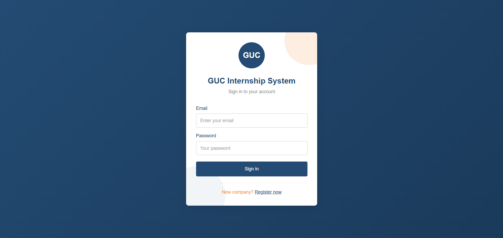
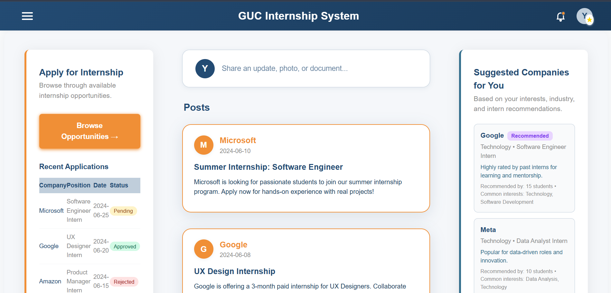
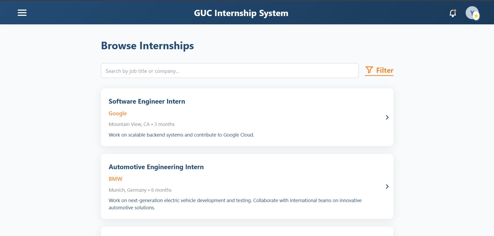
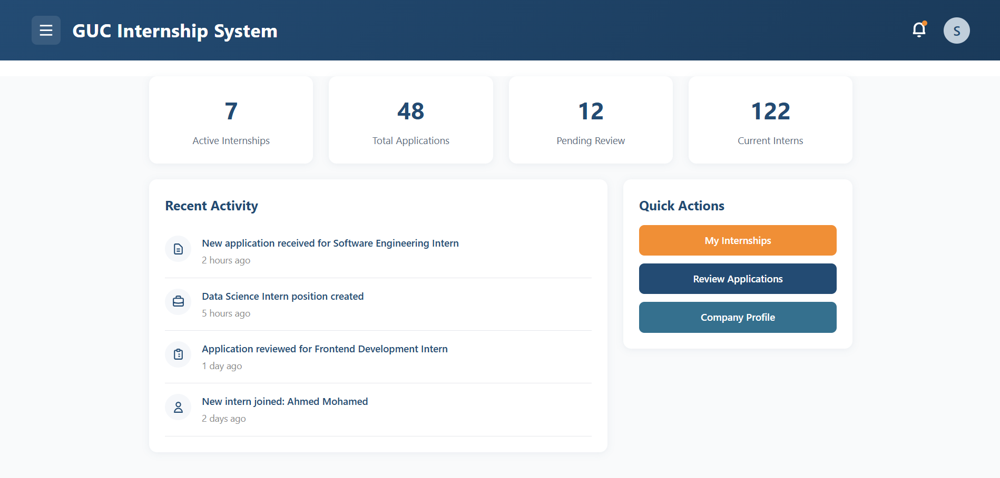
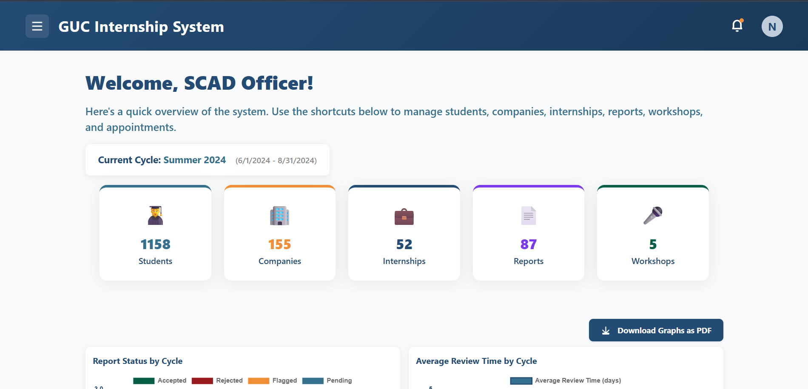
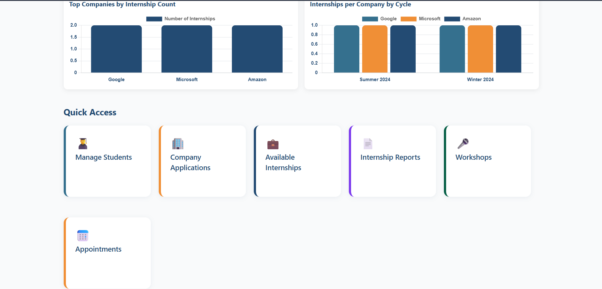

# GUC Internship Management System

## Motivation

The GUC Internship Management System is a comprehensive web application designed to streamline the internship process for students, companies, faculty members, and administrative staff at the German University in Cairo (GUC). This system addresses the need for a centralized platform where students can browse and apply for internships, companies can post opportunities and manage applications, faculty can evaluate student reports, and SCAD (Student Career and Development) staff can oversee the entire internship cycle. The platform aims to simplify communication, improve transparency, and enhance the overall internship experience for all stakeholders.

## Build Status

⚠️ **Current Issues:**
- The application currently uses dummy/mock data instead of a real backend API
- Authentication is implemented with hardcoded credentials for demonstration purposes
- No persistent data storage - all state is lost on page refresh
- Some features like real-time notifications require backend integration
- PDF generation for reports and certificates works but needs backend data integration
- The application is optimized for desktop view; mobile responsiveness needs improvement in some components
- Error handling for network requests is not fully implemented
- No actual email notification system is integrated
- File upload functionality (resumes, company logos) is simulated and not connected to storage services

## Code Style

This project follows consistent naming conventions and coding standards:

- **Components**: PascalCase (e.g., `StudentDashboard.js`, `CompanyProfile.js`)
- **Variables and Functions**: camelCase (e.g., `handleLogin`, `isAuthenticated`, `userType`)
- **Constants**: UPPER_SNAKE_CASE for global constants (e.g., `DUMMY_DATA`)
- **File Names**: Match component names exactly (e.g., `StudentDashboard.js` contains `StudentDashboard` component)
- **CSS Classes**: Tailwind CSS utility classes with custom GUC color variables (`guc-blue`, `guc-orange`)
- **State Variables**: Descriptive names prefixed with appropriate verbs (e.g., `setIsAuthenticated`, `setApplications`)
- **Props**: camelCase with descriptive names (e.g., `onLogin`, `userType`, `activePage`)
- **Hooks**: Standard React hooks naming (e.g., `useState`, `useEffect`, `useNavigate`)
- **Context**: Custom hooks prefixed with `use` (e.g., `useAuth`)

## Screenshots
### 1. Login Page


### 2. Student Dashboard


### 3. Browse Internships Page


### 4. Company Dashboard


### 5. SCAD Dashboard


### 6. SCAD Dashboard (continue)


## Tech/Framework Used

This project is built using the **React** frontend framework with the following technology stack:

- **Frontend Framework**: React 19.1.0
- **Routing**: React Router DOM 6.14.0
- **UI Libraries**: 
  - Material-UI (MUI) 5.17.1
  - Mantine 8.0.0
  - Emotion (for styled components)
- **Styling**: 
  - Tailwind CSS 3.4.17
  - Custom CSS with GUC brand colors
- **Icons**: React Icons 5.5.0
- **Charts**: Chart.js 4.4.9 with react-chartjs-2 5.3.0
- **PDF Generation**: jsPDF 3.0.1
- **Image Processing**: html2canvas 1.4.1
- **Testing**: 
  - Jest (via react-scripts)
  - React Testing Library 16.3.0
- **Build Tool**: Create React App (react-scripts 5.0.1)
- **Development Tools**: ESLint, PostCSS, Autoprefixer

**Note**: This is a frontend-only application. The backend (Node.js/Express) and database (MongoDB) components are planned for future implementation.

## Features

### Student Features
- **Dashboard**: View internship applications, reports status, and notifications
- **Profile Management**: Create and edit student profile with academic information, previous internships, and activities
- **Browse Internships**: Search and filter available internship opportunities by company, industry, location, and skills
- **Application Management**: Apply to internships and track application status (Pending, Approved, Rejected, Finalized)
- **My Internships**: View current and past internships with detailed information
- **Online Assessments**: Take skill-based assessments and view scores
- **Career Workshops**: Register for and view career development workshops
- **Workshop Certificates**: View and download workshop completion certificates
- **SCAD Appointments**: Schedule appointments with SCAD staff
- **Internship Guidelines**: Access guidelines and requirements for internships
- **Report Submission**: Submit internship reports and view feedback
- **Social Posts**: Create posts about achievements and assessments on profile

### Company Features
- **Company Registration**: Multi-step registration process with document upload
- **Dashboard**: View statistics on active internships, applications, and current interns
- **Internship Management**: Create, edit, and manage internship postings
- **Application Review**: Review student applications, accept/reject candidates
- **Current Interns**: View and manage currently active interns
- **Company Profile**: Manage company information and profile
- **Notifications**: Receive timed notifications about application updates

### SCAD (Administrative) Features
- **Dashboard**: Overview of students, companies, internships, and reports statistics
- **Student Management**: View and manage student profiles and information
- **Company Applications**: Review and approve company registration applications
- **Internship Oversight**: View all available internships in the system
- **Internship Cycle Management**: Manage internship cycles and deadlines
- **Report Management**: Review and manage student internship reports
- **Appointment Management**: Manage student appointments
- **Workshop Management**: Create and manage career workshops

### Faculty Features
- **Dashboard**: View assigned students and reports
- **Profile Management**: Manage faculty profile information
- **Report Evaluation**: Review, grade, and provide feedback on student internship reports

## Code Examples

### 1. Authentication Context and Protected Routes

```javascript
// App.js - Creating authentication context
const AuthContext = createContext(null);

export const useAuth = () => useContext(AuthContext);

const ProtectedRoute = ({ children }) => {
  const { isAuthenticated } = useAuth();
  const location = useLocation();
  
  if (!isAuthenticated) {
    return <Navigate to="/login" state={{ from: location }} replace />;
  }
  
  return children;
};
```

### 2. Login Handler Function

```javascript
// App.js - Login authentication logic
const handleLogin = (email, password) => {
  const allowedUsers = {
    'youssef.khaled@student.guc.edu.eg': { 
      password: 'youssef123', 
      isProStudent: true, 
      fullName: 'Youssef Khaled', 
      type: 'student' 
    },
    'nourhan.ehab@guc.edu.eg': { 
      password: 'nourhan123', 
      fullName: 'Nourhan Ehab', 
      type: 'scad' 
    },
    // ... more users
  };
  const userInfo = allowedUsers[email.toLowerCase()];
  if (email && password && userInfo && password === userInfo.password) {
    setIsAuthenticated(true);
    setUserType(userInfo.type);
    setUser({
      email,
      type: userInfo.type,
      fullName: userInfo.fullName,
      isProStudent: userInfo.isProStudent || false
    });
    return true;
  }
  return false;
};
```

### 3. Assessment Score Calculation

```javascript
// OnlineAssessments.js - Calculate assessment scores
const handleSubmit = () => {
  let s = 0;
  selectedAssessment.questions.forEach((q, i) => {
    if (answers[i] === q.answer) s++;
  });
  setScore(s);
  setShowScore(true);
  
  // Save score to auth context
  setAssessmentScores(prev => ({
    ...prev,
    [selectedAssessment.id]: {
      score: s,
      total: selectedAssessment.questions.length,
      title: selectedAssessment.title,
      date: new Date().toISOString()
    }
  }));
};
```

### 4. PDF Generation for Reports

```javascript
// CompanyMyInternships.js - Generate PDF export
const handleExportPDF = (internship) => {
  const doc = new jsPDF();
  doc.setFontSize(18);
  doc.text(internship.title, 14, 20);
  doc.setFontSize(12);
  doc.text(`Company: ${internship.company}`, 14, 30);
  doc.text(`Department: ${internship.department}`, 14, 40);
  doc.text(`Duration: ${internship.duration}`, 14, 50);
  doc.text(`Status: ${internship.status}`, 14, 60);
  doc.text(`Applicants: ${internship.applicants}`, 14, 70);
  doc.save(`${internship.title}-details.pdf`);
};
```

### 5. Dynamic Route Rendering Based on User Type

```javascript
// App.js - Conditional routing based on authentication
<Route 
  path="/dashboard" 
  element={
    <ProtectedRoute>
      {userType === 'student' ? (
        <StudentDashboard 
          user={user} 
          userType={userType} 
          onLogout={handleLogout} 
          activePage="dashboard" 
          posts={posts} 
          setPosts={setPosts} 
        />
      ) : (
        <Dashboard 
          userType={userType} 
          onLogout={handleLogout} 
          activePage="dashboard" 
        />
      )}
    </ProtectedRoute>
  } 
/>
```

### 6. Form Validation and Error Handling

```javascript
// CreateInternship.js - Form validation
const validateForm = () => {
  const newErrors = {};
  
  if (!formData.title.trim()) {
    newErrors.title = 'Title is required';
  }
  if (!formData.department.trim()) {
    newErrors.department = 'Department is required';
  }
  if (formData.isPaid && !formData.salary.trim()) {
    newErrors.salary = 'Salary is required for paid internships';
  }
  if (!formData.startDate) {
    newErrors.startDate = 'Start date is required';
  }
  if (!formData.endDate) {
    newErrors.endDate = 'End date is required';
  }
  if (formData.startDate && formData.endDate && 
      new Date(formData.startDate) >= new Date(formData.endDate)) {
    newErrors.endDate = 'End date must be after start date';
  }
  
  setErrors(newErrors);
  return Object.keys(newErrors).length === 0;
};
```

## Installation

To run this project locally, follow these steps:

### Prerequisites
- **Node.js**: Version 14.0 or higher
- **npm**: Version 6.0 or higher (comes with Node.js)

### Installation Steps

1. **Clone the repository**
   ```bash
   git clone https://github.com/yourusername/GUC-Internship_System.git
   cd GUC-Internship_System
   ```

2. **Install dependencies**
   ```bash
   npm install
   ```

3. **Start the development server**
   ```bash
   npm start
   ```
   
   The application will open in your browser at `http://localhost:3000`


### Environment Setup
- No environment variables are currently required as the application uses dummy data
- For future backend integration, you may need to create a `.env` file with API endpoints

### Browser Compatibility
- Chrome (recommended)
- Firefox
- Safari
- Edge

## API References

Since this is a frontend-only application using dummy data, the following routes represent the intended API endpoints that would be implemented with a backend:

### Authentication Routes
1. **POST /api/auth/login**
   - Description: Authenticate user and return JWT token
   - Request Body: `{ email: string, password: string }`
   - Response: `{ token: string, user: UserObject, userType: string }`

2. **POST /api/auth/logout**
   - Description: Logout user and invalidate session
   - Headers: `Authorization: Bearer <token>`
   - Response: `{ message: "Logged out successfully" }`

### Student Routes
3. **GET /api/students/:id/profile**
   - Description: Get student profile information
   - Headers: `Authorization: Bearer <token>`
   - Response: `{ student: StudentProfileObject }`

4. **GET /api/internships**
   - Description: Get all available internships with filtering options
   - Query Parameters: `?industry=Technology&location=Cairo&paid=true`
   - Response: `{ internships: Internship[] }`

5. **POST /api/applications**
   - Description: Submit internship application
   - Request Body: `{ internshipId: number, resume: File, coverLetter: string }`
   - Response: `{ applicationId: number, status: "pending" }`

### Company Routes
6. **POST /api/companies/register**
   - Description: Register new company
   - Request Body: `{ companyName: string, email: string, documents: File[] }`
   - Response: `{ companyId: number, status: "pending" }`

7. **POST /api/companies/internships**
   - Description: Create new internship posting
   - Request Body: `{ title: string, description: string, requirements: string[] }`
   - Response: `{ internshipId: number }`

8. **GET /api/companies/:id/applications**
   - Description: Get all applications for company's internships
   - Response: `{ applications: Application[] }`

9. **PUT /api/applications/:id/status**
   - Description: Update application status (accept/reject)
   - Request Body: `{ status: "accepted" | "rejected" }`
   - Response: `{ message: "Status updated" }`

### SCAD Routes
10. **GET /api/scad/dashboard/stats**
    - Description: Get dashboard statistics
    - Response: `{ students: number, companies: number, internships: number, reports: number }`

11. **GET /api/scad/students**
    - Description: Get all students with filtering
    - Response: `{ students: Student[] }`

12. **PUT /api/companies/:id/approve**
    - Description: Approve company registration
    - Response: `{ message: "Company approved" }`

### Faculty Routes
13. **GET /api/faculty/reports**
    - Description: Get assigned student reports
    - Response: `{ reports: Report[] }`

14. **PUT /api/reports/:id/grade**
    - Description: Grade and provide feedback on report
    - Request Body: `{ grade: string, feedback: string }`
    - Response: `{ message: "Report graded" }`

### Assessment Routes
15. **GET /api/assessments**
    - Description: Get available online assessments
    - Response: `{ assessments: Assessment[] }`

16. **POST /api/assessments/:id/submit**
    - Description: Submit assessment answers and get score
    - Request Body: `{ answers: number[] }`
    - Response: `{ score: number, total: number }`

## Tests

The project includes testing setup using Jest and React Testing Library. Tests can be run using `npm test`.

### Test Examples

1. **Component Rendering Test**
   ```javascript
   // App.test.js
   test('renders learn react link', () => {
     render(<App />);
     const linkElement = screen.getByText(/learn react/i);
     expect(linkElement).toBeInTheDocument();
   });
   ```

2. **Authentication Test** (to be implemented)
   - Test successful login with valid credentials
   - Test login failure with invalid credentials
   - Test protected route redirection

3. **Form Validation Test** (to be implemented)
   - Test internship creation form validation
   - Test required field validation
   - Test date range validation

4. **State Management Test** (to be implemented)
   - Test application state updates
   - Test assessment score calculation
   - Test notification system

5. **Navigation Test** (to be implemented)
   - Test route navigation based on user type
   - Test protected route access
   - Test logout functionality

## Contribute

We welcome contributions to improve the GUC Internship Management System! Here are areas where contributions would be valuable:

### Areas for Contribution
- **Backend Integration**: Implement REST API endpoints and connect frontend to backend
- **Database Design**: Design and implement database schema for all entities
- **Authentication**: Implement secure JWT-based authentication system
- **File Upload**: Implement actual file upload functionality for resumes and company documents
- **Email Notifications**: Integrate email service for notifications
- **Mobile Responsiveness**: Improve mobile UI/UX for better mobile experience
- **Error Handling**: Add comprehensive error handling and user feedback
- **Testing**: Write unit tests, integration tests, and end-to-end tests
- **Documentation**: Improve code documentation and add JSDoc comments
- **Performance Optimization**: Optimize component rendering and bundle size
- **Accessibility**: Improve accessibility features (ARIA labels, keyboard navigation)
- **Internationalization**: Add multi-language support

### How to Contribute
1. Fork the repository
2. Create a feature branch (`git checkout -b feature/AmazingFeature`)
3. Commit your changes (`git commit -m 'Add some AmazingFeature'`)
4. Push to the branch (`git push origin feature/AmazingFeature`)
5. Open a Pull Request

### Code of Conduct
- Follow the existing code style and naming conventions
- Write clear commit messages
- Add comments for complex logic
- Update documentation for new features
- Ensure all tests pass before submitting PR

## Credits

This project was developed as part of the GUC Softwar engineering course requirements. The following resources were used for learning and implementation:

### Documentation and Tutorials
- **React Official Documentation**: https://react.dev/
- **React Router Documentation**: https://reactrouter.com/
- **Material-UI Documentation**: https://mui.com/
- **Mantine Documentation**: https://mantine.dev/
- **Tailwind CSS Documentation**: https://tailwindcss.com/
- **Chart.js Documentation**: https://www.chartjs.org/

### YouTube Tutorials and Channels
- React tutorials for component structure and state management
- React Router tutorials for navigation and protected routes
- Material-UI component usage examples
- Tailwind CSS styling tutorials
- Chart.js integration guides

### Libraries and Packages
- All dependencies are listed in `package.json` with their respective licenses
- Special thanks to the open-source community for the excellent libraries used in this project

### Design Inspiration
- GUC brand guidelines for color scheme and design principles
- Modern web application UI/UX best practices
- Material Design principles

### Team Members
- Youssef Khaled
- Salma Ahmed
- Nourhan Ehab


## License

This project is licensed under the **ISC License**.

### Third-Party Licenses
The following third-party libraries are used in this project and have their own licenses:

- **React**: MIT License
- **Material-UI (MUI)**: MIT License
- **Mantine**: MIT License
- **Chart.js**: MIT License
- **jsPDF**: MIT License
- **React Router**: MIT License
- **Tailwind CSS**: MIT License

All dependencies and their licenses can be viewed in the `package.json` file and `node_modules` directory.

### License Notice
If this project uses any services or libraries that require specific license attribution (such as Apache 2.0 for Stripe if payment processing is added), those licenses must be included in this section.

---

